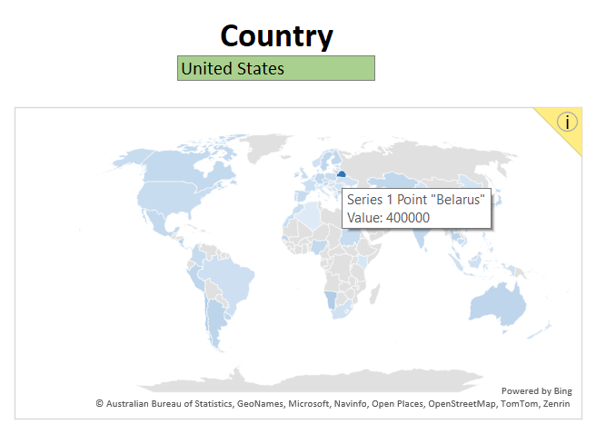
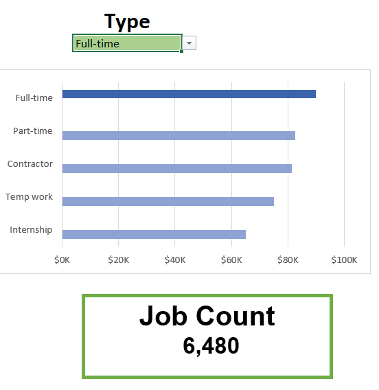

# Excel Salary Calculator Dashboard


## Introduction

As part of my learning journey into data analysis and Excel dashboards, I created this salary dashboard under the mentorship of [mentor's first name]. The dashboard helps job seekers explore salary trends across different job roles, countries, and working styles.

This project helped me understand how to use Excel not only for data entry, but also for visualizing and interpreting real-world job data effectively.

### 📂 Dashboard File

- [Excel Salary Dashboard File](Salary_Calculator.xlsx)

## 🧠 Excel Skills Used

- 📊 Charts (Bar, Map)
- 🧮 Formulas & Array Functions
- 📋 Data Validation
- 🔍 Slicers & Filters

## 📊 Dataset Description

The dataset contains salary information from data-related jobs in 2023, including:
- Job Titles
- Median Salaries
- Countries
- Job Schedule Types (e.g. Full-time, Part-time)
- Technical Skills Required

## 📈 Dashboard Features

### 1. **Median Salary by Job Title**
- Horizontal bar chart showing median salaries by role.

-

-

### 2. **Country-Level Salary Map**
- Map chart highlights regional salary differences.
- Color-coded for easy understanding of high and low paying countries.

-

-

### 3. **Count of Job Schedule Type**
- Populates the table below, which gives us a list of unique job schedule types.

- 

- 
  

## 🔢 Key Excel Formulas Used

### Median Salary Calculation (Array Formula):

```excel
=MEDIAN(
IF(
    (jobs[job_title_short]=A2)*
    (jobs[job_country]=country)*
    (ISNUMBER(SEARCH(type,jobs[job_schedule_type])))*
    (jobs[salary_year_avg]<>0),
    jobs[salary_year_avg]
) 
)
```

### Job Country Filter Calculation

```excel
=SORT(FILTER(A2:B112,ISNUMBER(B2:B112)),2,-1)
```

### Count of Job Schedule Type Calculation

```excel

=FILTER(J2#,NOT(ISNUMBER(SEARCH("and",J2#)))*(J2#<>0))

```

## ❎ Data Validation

- 📋 I implemented **data validation** to create dropdowns for `Job Title`, `Country`, and `Job Schedule Type`.
- ✅ This ensures users select only valid options, preventing incorrect or inconsistent inputs.
- 🧮 I used Excel formulas to generate **dynamic, filtered lists** for clean values.
- 🎯 The validated inputs drive key formulas like the **Median Salary** calculation.
- 🚀 This improved dashboard **usability, accuracy, and interactivity**.


## 🧾 Conclusion

This Excel dashboard helped me explore salary trends across data-related roles.  
By using charts, formulas, and data validation, I built an interactive and insightful tool.  
I gained hands-on experience in cleaning data, creating dynamic visuals, and applying Excel logic.  
The project improved my confidence in data analysis and dashboard design.  
It reflects my ability to turn raw data into meaningful insights.


